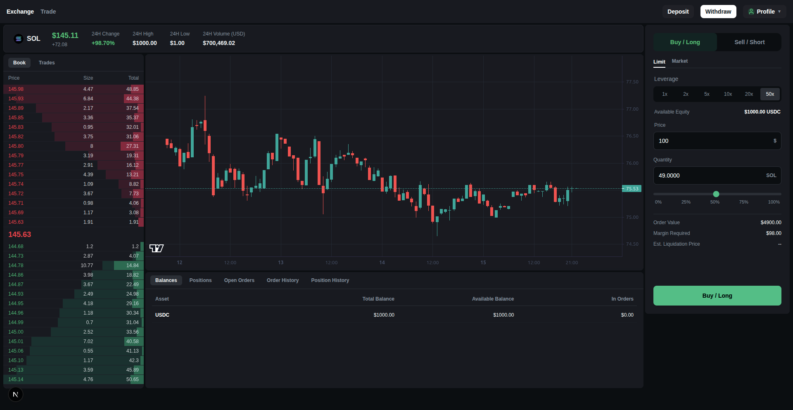

<h1 align="center">CEX_RUST ⚡</h1>

<p align="center">
    A spot centralized crypto exchange built with Rust, Tokio, Actix Web, Redis Streams, and PostgreSQL.
    <br /> <br />
    <a href="#introduction"><strong>Introduction</strong></a> ·
    <a href="#user-interface"><strong>User Interface</strong></a> ·
    <a href="#features"><strong>Features</strong></a> ·
    <a href="#tech-stack"><strong>Tech Stack</strong></a> ·
    <a href="#api-endpoints"><strong>API Endpoints</strong></a> ·
    <a href="#websocket-streams"><strong>WebSocket Streams</strong></a> ·
    <a href="#order-matching--execution"><strong>Order Matching & Execution</strong></a> ·
    <a href="#market-maker-simulator"><strong>Market Maker Simulator</strong></a> ·
    <a href="#local-development"><strong>Local Development</strong></a> ·
    <a href="#license"><strong>License</strong></a>
</p>
<p align="center">
  <a href="https://x.com/Div5533">
    
  </a>
</p>

## Introduction

CEX_RUST is an event-driven spot exchange written in Rust. It is a Cargo workspace of independent services that communicate over Redis Streams. The matching engine keeps order books and user balances in memory and runs one Tokio task per market (`BTC`, `ETH`, `SOL`, quoted in `USDT`). Order books use B-Trees for sorted price levels and FIFO queues within each level. A REST gateway, a WebSocket depth feed, and an asynchronous DB poller that writes orders and fills to PostgreSQL surround the engine.

## User Interface



## Features

- ⚡ **In-memory Matching Engine**: Price-time priority matching on in-memory order books, with no database calls on the hot path.
- 🧵 **Market-per-Task Concurrency**: Every market runs in its own Tokio task. A central balance task owns all user balances, and the tasks talk over `mpsc` channels with no shared locks.
- 🏦 **Balance Reservation & Locking**: Funds are reserved before an order reaches the book, locked while it rests, and settled on fills or released on cancellation.
- 🔥 **Real-time WebSockets**: Order book depth is pushed to subscribed clients every 300ms.
- 📦 **Decoupled Persistence**: A background DB poller writes orders, fills, and cancellations to PostgreSQL without slowing down the engine.
- 🔌 **Request/Response over Streams**: The REST gateway tags each engine request with a correlation ID and waits for the matching response on `to-backend`.
- 🔐 **JWT Authentication**: bcrypt-hashed passwords and HS256 JWT middleware protect the trading routes.

## Tech Stack

- [Rust](https://www.rust-lang.org/): Core language, organized as a Cargo workspace.
- [Tokio](https://tokio.rs/): Async runtime, tasks, and channels.
- [Actix Web](https://actix.rs/): Web framework for the REST API.
- [Redis Streams](https://redis.io/docs/latest/develop/data-types/streams/): Message bus between services.
- [PostgreSQL](https://www.postgresql.org/): Persistent storage for users, orders, and fills.
- [SQLx](https://github.com/launchbadge/sqlx): Compile-time checked queries and migrations.
- [tokio-tungstenite](https://github.com/snapview/tokio-tungstenite): WebSocket server.
- [rust_decimal](https://github.com/paupino/rust-decimal): Exact decimal arithmetic for prices and quantities.
- [jsonwebtoken](https://github.com/Keats/jsonwebtoken) & [bcrypt](https://github.com/Keats/rust-bcrypt): Authentication.

### Components

1. **REST API Gateway (`crates/router`)**

   - Handles REST API requests (auth, orders, balances, depth).
   - Publishes engine requests to the `to-engine` stream with a unique correlation ID and waits up to 10s for the matching response.
   - Queries PostgreSQL directly for auth and order lookups.

2. **Redis Streams Message Bus**

   - `to-engine`: Inbound requests (create order, cancel order, onramp, get depth, get balance).
   - `to-backend`: Engine responses (order results with trades and the updated depth, cancellations, balances), read by the router, WebSocket server, and DB poller.

3. **Matching Engine (`crates/engine`)**

   - An ingester task reads `to-engine` and forwards requests to the balance task.
   - The balance task owns every user's balances, validates and reserves funds, and routes orders to the right market.
   - One market task per symbol owns its order book, matches orders, publishes the results, and sends balance updates back to the balance task.

4. **WebSocket Server (`crates/web-socket-server`)**

   - Reads `to-backend` and caches the latest depth for each market.
   - Pushes order book depth to subscribed clients every 300ms.

5. **DB Poller (`crates/db-poller`)**

   - Background worker that reads engine responses from `to-backend`.
   - Inserts orders and fills, and updates order status on fills and cancellations in PostgreSQL.

6. **Shared Crates (`crates/types`, `crates/db`)**

   - `types`: The shared wire protocol (`EngineRequest` / `EngineResponse`) and order book types.
   - `db`: PostgreSQL connection pool. It runs migrations at startup.

## API Endpoints

### Health

- `GET /health` -> Service health check

### Authentication

- `POST /api/v1/sign-up` -> Register a new trader account
- `POST /api/v1/sign-in` -> Authenticate a trader and receive a JWT

### Account & Balance

- `POST /api/v1/onramp` -> Seed test balances for the user (`BTC`, `ETH`, `SOL`, `USDT`)
- `GET /api/v1/balance` -> Get the user's available, locked, and reserved balances

### Order Management

- `POST /api/v1/order` -> Create a new BUY or SELL order (limit/market)
- `GET /api/v1/order/{order_id}` -> Get an order by ID
- `DELETE /api/v1/order/{order_id}` -> Cancel an open limit order

### Market Data

- `GET /api/v1/depth/{market}` -> Get live order book depth (bids and asks)

Every route except `health`, `sign-up`, `sign-in`, and `depth` requires an `Authorization: Bearer <jwt>` header.

Example order body:

```json
{
  "market": "SOL",
  "qty": "2.5",
  "price": "70.10",
  "type": "limit",
  "side": "BUY"
}
```

## WebSocket Streams

Connect to `ws://127.0.0.1:9001`:

```json
{ "method": "SUBSCRIBE", "params": ["depth.SOL"] }
{ "method": "UNSUBSCRIBE" }
```

Subscribed clients receive:

```json
{ "data": { "type": "depth", "bids": [["70.10", "2.5"]], "asks": [["70.25", "1.2"]] } }
```

## Order Matching & Execution

#### Data Structures

```rust
// In-memory Orderbook (B-Tree price levels + FIFO queue per level)
pub struct Orderbook {
    pub bids: BTreeMap<Decimal, RestingOrder>,
    pub asks: BTreeMap<Decimal, RestingOrder>,
    pub last_traded_price: Decimal,
}

pub struct RestingOrder {
    pub available_qty: Decimal,
    pub orders: VecDeque<Orders>,
}

// Order Definition
pub struct Orders {
    pub order_id: String,
    pub user_id: String,
    pub market: String,
    pub side: Side,            // BUY | SELL
    pub qty: Decimal,
    pub r#type: TypeOfOrder,   // LIMIT | MARKET
    pub price: Decimal,
    pub status: OrderStatus,   // OPEN | PartialyFilled | FILLED | CANCEL
}

// User Balances (userId -> asset -> UserBalance)
pub struct UserBalance {
    pub available_balance: Decimal,
    pub locked_balance: Decimal,
    pub reserve_balance: Decimal,
}

pub struct Trade {
    pub maker_order_id: String,
    pub taker_order_id: String,
    pub maker_user_id: String,
    pub taker_user_id: String,
    pub fill_qty: Decimal,
    pub price: Decimal,
}
```

#### Order Execution Flow

- The router publishes a `CreateOrder` / `DeleteOrder` request with a correlation ID to `to-engine`.
- The engine's ingester reads the request and hands it to the balance task.
- The balance task checks the user's available balance and reserves the funds: `qty × price` in USDT for a buy, `qty` of the asset for a sell. It then sends the order to that market's task.
- The market task matches the order against the opposite side of the book with price-time priority. A limit order's unfilled remainder rests on the book and its funds are locked.
- Balance changes from each fill go back to the balance task over channels.
- The result is published to `to-backend`: status, filled quantity, trades, and the updated depth.
- The router returns it to the waiting HTTP request, the WebSocket server updates its depth cache, and the DB poller saves the order and fills to PostgreSQL.

## Market Maker Simulator

A fish script simulates two-sided quoting and aggressive crossing orders:

```bash
./onramp-service.fish   # fund the two test accounts
./market-maker.fish
```

What it does:
- Uses two test trader accounts, funded through `/onramp`.
- Posts random two-sided limit orders around a drifting mid price across the `BTC`, `ETH`, and `SOL` markets.
- Occasionally sends aggressive orders that cross the spread and generate fills.

## Local Development

Prerequisites: Rust (edition 2024), PostgreSQL, and Redis.

```bash
git clone https://github.com/Dev050x/CEX_RUST.git
cd CEX_RUST
```

Create a `.env` file in the repo root:

```env
DATABASE_URL=postgres://<user>:<password>@localhost:5432/<db>
REDIS_URL=redis://127.0.0.1:6379
JWT_SECRET=<your-secret>
```

Start all services. Migrations run automatically at startup:

```bash
cargo run -p engine
cargo run -p router
cargo run -p db-poller
cargo run -p web-socket-server
```

Or run `./start-service.fish` to start them all together, with logs written to `logs/<service>.log`.

> The router uses SQLx compile-time checked queries, so PostgreSQL must be reachable at `DATABASE_URL` when you build.

## License

CEX_RUST is open-source under the [MIT License](LICENSE).
